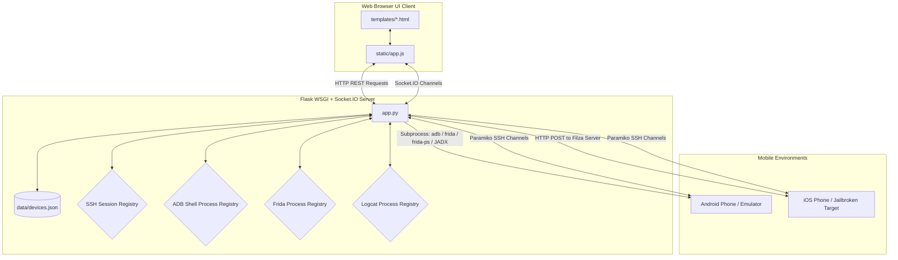

# RootRaven Engineering Memory & Architecture Map (`brain.md`)

This document serves as the project's **engineering memory** and **reverse-engineering map**. It details the internal workings, dependencies, execution flows, and security profiles of **RootRaven**, an orchestration dashboard for mobile security testing.

---

## 1. Project Overview

**RootRaven** is a specialized dashboard and command center for mobile application security testing. It provides a web-based interface for managing a fleet of Android and iOS devices, orchestrating remote diagnostics tools (ADB, Frida, Objection), decompiling applications, transferring payloads, and executing interactive secure shells.

### Core Features
- **Fleet Registry**: CRUD actions for tracking test targets (IP, Platform, Credentials).
- **Android ADB Helper**: Remote network connections over ADB, file system navigation, file uploads, and APK package installations.
- **Android HTTP Server Launcher**: Spawn ephemeral web servers on Android targets (via Python, toybox, or busybox) to expose directory listings.
- **Frida Script Hub & Injector**: Automates Frida-server startup on Android, queries running app lists using `frida-ps`, launches Objection shells, manages custom javascript script uploads/editing, and injects runtime scripts dynamically while streaming standard output to the logs screen. Includes built-in Root Bypass and Jailbreak Bypass scripts.
- **Interactive Logcat Streamer**: Streams real-time `adb logcat` output over Socket.IO websockets with customizable text search filter parameters.
- **Storage & SharedPreferences Explorer**: Scans Android application data directories for SQLite databases and XML SharedPreferences configurations. Provides interactive SQL query panels and XML readers directly in the browser.
- **Burp CA Certificate Installer**: Automates Subject Hash calculation using `openssl`, pushes certificates to devices, remounts partitioning as read-write, and copies CA certs to Android system trusts (`/system/etc/security/cacerts/`).
- **Interactive Screen Mirroring**: Captures target device screenshot streams dynamically over Socket.IO and intercepts client viewport clicks to trigger target device touch taps (`input tap`).
- **Network ADB Shell Console**: Pipes custom shell inputs/outputs dynamically to background interactive `adb shell` processes via terminal consoles.
- **Automated JADX Decompiler**: Integrates JADX decompile operations in the background for uploaded APKs, rendering folder structures and code files in a source viewer UI.
- **Frida Memory Searcher**: Enumerate and scan process memory segments for custom string patterns (`Memory.scanSync`), outputting match addresses back to Server Logs.
- **iOS Filza Bridge**: Connects to Filza's web service (default port `11111`) for file uploads and trigger IPA installer API calls.
- **Paramiko-based SSH Client**: Persistent interactive terminal emulator communicating over websockets (Socket.IO).
- **Live Logging Console**: Intercepts backend logs (Flask/Werkzeug/System loggers) and streams them dynamically to the UI console.

### Technologies & Frameworks
- **Backend Framework**: Python 3.8+, Flask, Flask-SocketIO (WebSocket support), and Eventlet WSGI.
- **Networking/Shells**: Paramiko (SSH), Requests (HTTP client), Subprocess execution.
- **Frontend**: Vanilla HTML5, Vanilla CSS3 (glassmorphic theme), Vanilla Javascript (ES6), and Socket.IO client library.

### Runtime Requirements
- **Host System**: Windows, Linux, or macOS with Python 3.8+, JADX (in System PATH), `openssl` binary, and ADB CLI client installed globally in the system PATH.
- **Mobile Targets**: 
  - Android: Network ADB access enabled (`adb tcpip 5555`), rooted, with Frida binaries placed in `/data/local/tmp/`.
  - iOS: Jailbroken, SSH installed, Filza File Manager installed with its Web Server activated on port `11111`.

---

## 2. Complete Project Structure

```text
mobile_testing_tool/
├── .github/
│   └── workflows/
│       └── python-app.yml         # CI workflow for code linting (flake8)
├── bin/
│   └── README.txt                 # Documentation for placing architecture-specific BusyBox binaries
├── data/
│   ├── devices.json               # Flat-file database storing registered target configurations
│   └── scripts/                   # Saved Frida hooks for injection
│       ├── android_root_bypass.js # Built-in Android root evasion script
│       ├── ios_jb_bypass.js       # Built-in iOS jailbreak evasion script
│       └── memory_scanner.js      # Dynamic in-process memory scanner script
├── static/
│   ├── app.js                     # Core client-side execution logic (AJAX, Websockets, UI binding)
│   └── style.css                  # Premium dark-mode cyber design stylesheet
├── templates/
│   ├── apps.html                  # Frida App Listing, Script Hub, SQLite Browser, and JADX UI
│   ├── devices.html               # Fleet Configuration Form and CRUD table template
│   └── index.html                 # Main dashboard, logcat, mirroring, SSH, and ADB console UI
├── utils/
│   ├── __init__.py                # Package initialization file
│   ├── adb_helper.py              # Subprocess wrapper executing adb commands for Android targets
│   ├── device_manager.py          # CRUD manager handling JSON-file reads/writes to devices.json
│   └── frida_manager.py           # Interface wrapper executing frida-ps & launching Objection cli
├── app.py                         # Application entry point, server configuration, and api/socket routes
├── requirements.txt               # Main python packages configuration
├── start_mobile_testing_tool.bat  # Quickstart batch runner for Windows environment
└── objection_com_reliance_businesseasy2.bat # Sample batch script demonstrating standalone Objection launch
```

### Key Files and Component Boundaries

1. **[app.py](file:///d:/Docs/Moblie/mobile_testing_tool/app.py)**
   - *Purpose*: Main application router, server initializer, background process thread manager, and logger.
   - *Dependencies*: Imports [device_manager.py](file:///d:/Docs/Moblie/mobile_testing_tool/utils/device_manager.py), [frida_manager.py](file:///d:/Docs/Moblie/mobile_testing_tool/utils/frida_manager.py), and [adb_helper.py](file:///d:/Docs/Moblie/mobile_testing_tool/utils/adb_helper.py).
   - *Safety*: Safe to modify API endpoints or add new Socket.IO event registrations directly.

2. **[utils/adb_helper.py](file:///d:/Docs/Moblie/mobile_testing_tool/utils/adb_helper.py)**
   - *Purpose*: Process wrapper executing ADB actions for Android targets, SQLite file query parsing, CA trust installations, and screen capture/input emulation.
   - *Dependencies*: `subprocess`, `os`, `sqlite3`, `tempfile`.
   - *Safety*: Modify with care; errors here will directly halt Android integration functionalities.

3. **[utils/device_manager.py](file:///d:/Docs/Moblie/mobile_testing_tool/utils/device_manager.py)**
   - *Purpose*: Read/Write adapter for [data/devices.json](file:///d:/Docs/Moblie/mobile_testing_tool/data/devices.json).
   - *Dependencies*: `json`, `os`, `uuid`.
   - *Safety*: Safe to modify. If schema definitions change, existing entries inside `devices.json` must be manually updated or cleared.

4. **[utils/frida_manager.py](file:///d:/Docs/Moblie/mobile_testing_tool/utils/frida_manager.py)**
   - *Purpose*: Wraps python execution calling `frida-ps` output parse and manages script file storage inside `data/scripts/`.
   - *Dependencies*: `subprocess`, `sys`, `os`.
   - *Safety*: Requires specific CLI commands available on the host path. Shell execution syntax behaves differently between Windows (`start cmd /k`) and UNIX.

5. **[static/app.js](file:///d:/Docs/Moblie/mobile_testing_tool/static/app.js)**
   - *Purpose*: Central client script controlling HTML interactions, routing indicators, API bindings, Socket.IO channels, toast messages, and state bindings.
   - *Dependencies*: Socket.IO CDN client script loaded inside HTML files.
   - *Safety*: Safe to modify. Ensure functions bound to `window` (e.g. `__objection`, `__editDevice`) remain globally scoped.

---

## 3. Architecture

RootRaven follows a hybrid architecture, using standard REST endpoints for state configurations and WebSockets (via Socket.IO) for real-time orchestration streams (Frida process listings, script console output streams, logcat lines, mirror frame streams, interactive SSH sessions, and logger overlays).



---

## 4. Application Build Flow

RootRaven is a dynamic Python program and requires no compilation step.

```text
Source Code (Git clone)
   ↓
Environment Prep (Python 3.8+)
   ↓
Install dependencies (pip install -r requirements.txt)
   ↓
Runtime Start (python app.py)
```

### Installation and Boot Commands
1. **Dependency Installation**:
   ```bash
   pip install -r requirements.txt
   ```
2. **Execution command (Windows Batch)**:
   ```cmd
   start_mobile_testing_tool.bat
   ```
3. **Execution command (Manual Python)**:
   ```bash
   python app.py
   ```

---

## 5. Runtime / Execution Flow

When RootRaven starts, the backend initializes services, hooks into system logging, and boots the WSGI HTTP/Websocket listener.

```text
Application Start (app.py)
      ↓
Hook loggers into SocketIOLogHandler
      ↓
Instantiate DeviceManager, FridaManager, ADBHelper
      ↓
Initialize temporary file directory (tempfile.gettempdir() / mobile_uploads)
      ↓
Register Flask routes and socket event callbacks
      ↓
Launch Socket.IO server via socketio.run() on port 5000
```

### Execution Path (Real Code Tracing)
1. System boot starts at `if __name__ == "__main__":` inside [app.py](file:///d:/Docs/Moblie/mobile_testing_tool/app.py), launching the web server.
2. The log-hook `SocketIOLogHandler` in [app.py:L22](file:///d:/Docs/Moblie/mobile_testing_tool/app.py#L22) is appended to standard library logging instances (`werkzeug` and root logger).
3. Client browser queries `http://127.0.0.1:5000/`. Flask serves [templates/index.html](file:///d:/Docs/Moblie/mobile_testing_tool/templates/index.html) and client initiates socket connection via `io()` in [static/app.js:L1](file:///d:/Docs/Moblie/mobile_testing_tool/static/app.js#L1).
4. `app.js` runs `bootstrap()`, detects page routing, fetches target list using `api("/api/devices")`, and builds UI layout.

---

## 6. Request / Data Flow

### A. Dynamic Interactive SSH Session Flow
```text
User input cmd → POST /api/ssh/send → Check session ID → Send raw bytes → Wait delay → Collect return bytes → JSON output
```

- **Step 1 (Establish Connection)**: The user enters SSH data and triggers `connectSshBtn.onclick`. Client sends a POST to `/api/ssh/connect`.
  - *Backend File*: [app.py](file:///d:/Docs/Moblie/mobile_testing_tool/app.py) (`ssh_connect()`).
  - *Action*: Spawns `paramiko.SSHClient()`, connects to host, spawns interactive channel (`client.invoke_shell()`), reads welcome banner.
  - *Output*: Session UUID key is saved in memory `SSH_SESSIONS[session_id]` and returned to client.
- **Step 2 (Command Routing)**: User enters commands in terminal field and clicks Execute. Client sends POST to `/api/ssh/send`.
  - *Backend File*: [app.py](file:///d:/Docs/Moblie/mobile_testing_tool/app.py) (`ssh_send()`).
  - *Action*: Looks up session dictionary, executes `channel.send(command + "\n")`, delays execution (`time.sleep(0.35)`), and pulls output.
  - *Output*: Returns raw terminal output string via JSON.
- **Step 3 (Terminate)**: User clicks Terminate. Client sends POST to `/api/ssh/disconnect`.
  - *Backend File*: [app.py](file:///d:/Docs/Moblie/mobile_testing_tool/app.py) (`ssh_disconnect()`).
  - *Action*: Closes SSH channel, closes connection pool client, pops key from dict.

### B. Frida Script Injection Flow
```text
Client requests run_frida_script event → Check task conflicts → Write script content to temp file → Spawn subprocess → Reader thread pipes lines to debug_log websocket channel
```

- **Step 1 (Inject Trigger)**: User triggers script execution on `/apps`. Script hub saves/retrieves JS script, packages payload, and emits `run_frida_script` event.
- **Step 2 (Task Conflict check)**:
  - *Backend File*: [app.py](file:///d:/Docs/Moblie/mobile_testing_tool/app.py) (`handle_run_frida_script()`).
  - *Action*: Spawns task lock matching `device_id` and `package_name`. Terminate any pre-existing background tasks matching that key.
- **Step 3 (Subprocess Spawn)**: Writes target script to a temp directory, and runs `frida -U --no-pause -f <package> -l <temp_script>`. Spawns a non-blocking `Thread` executing output polls and emits stdout output lines back to client.

---

## 7. Core Code Snippets

### Logcat Background Thread Spawner
```python
# Location: app.py
# Purpose: Dynamic subprocess spawn running logcat and streaming lines asynchronously
proc = subprocess.Popen(
    f'adb -s {device["ip"]}:5555 logcat -v time',
    stdout=subprocess.PIPE,
    stderr=subprocess.STDOUT,
    text=True,
    bufsize=1,
    shell=True
)
RUNNING_LOGCAT_PROCESSES[device_id] = proc
emit("logcat_status", {"status": "success", "message": "Logcat started"})

def read_logcat(process, dev_id, flt):
    try:
        for line in iter(process.stdout.readline, ""):
            cleaned_line = line.strip()
            if not cleaned_line:
                continue
            if flt and flt.lower() not in cleaned_line.lower():
                continue
            socketio.emit("logcat_line", {"device_id": dev_id, "line": cleaned_line})
        process.stdout.close()
    except Exception:
        pass

threading.Thread(target=read_logcat, args=(proc, device_id, filter_text), daemon=True).start()
```

### SQLite Remote File Query Mechanism
```python
# Location: utils/adb_helper.py
# Purpose: Copies remote SQL database files locally to query schemas and table records using Python's SQLite wrapper
def query_db_android(self, device, package, db_path, sql_query):
    import sqlite3
    import tempfile
    
    # 1. Copy database file to safe location on device
    cmd_copy = f'adb -s {target} shell "su -c \\"cp \\"{db_path}\\" /data/local/tmp/temp_db.db && chmod 666 /data/local/tmp/temp_db.db\\""'
    self._run(cmd_copy)
    
    # 2. Pull local copy to server environment
    self._run(f'adb -s {target} pull /data/local/tmp/temp_db.db "{local_db_path}"')
    self._run(f'adb -s {target} shell "rm /data/local/tmp/temp_db.db"')
    
    # 3. Read tables and output results
    conn = sqlite3.connect(local_db_path)
    cursor = conn.cursor()
    cursor.execute(sql_query)
    columns = [desc[0] for desc in cursor.description]
    rows = cursor.fetchall()
    return {"status": "success", "columns": columns, "rows": rows}
```

---

## 8. Important Functions and Classes

| Component | Location | Purpose | Called By | Calls |
| :--- | :--- | :--- | :--- | :--- |
| `DeviceManager` (Class) | [device_manager.py](file:///d:/Docs/Moblie/mobile_testing_tool/utils/device_manager.py) | Fleet metadata file-store manager | `app.py` instantiation | JSON parsing built-ins |
| `ADBHelper` (Class) | [adb_helper.py](file:///d:/Docs/Moblie/mobile_testing_tool/utils/adb_helper.py) | ADB subprocess orchestrator | `app.py` instantiation | System subprocess executor |
| `FridaManager` (Class) | [frida_manager.py](file:///d:/Docs/Moblie/mobile_testing_tool/utils/frida_manager.py) | Frida CLI runtime interface wrapper | `app.py` instantiation | System subprocess executor |
| `list_app_files_android` | [adb_helper.py](file:///d:/Docs/Moblie/mobile_testing_tool/utils/adb_helper.py) | Scans Android application folders for db/xml configs | HTTP GET `/api/device/db/list` | ADB CLI queries |
| `query_db_android` | [adb_helper.py](file:///d:/Docs/Moblie/mobile_testing_tool/utils/adb_helper.py) | Copy, pulls, and executes SQL commands on remote DB files | HTTP POST `/api/device/db/query` | Python `sqlite3` wrapper |
| `install_ca_cert_android` | [adb_helper.py](file:///d:/Docs/Moblie/mobile_testing_tool/utils/adb_helper.py) | Installs custom PEM/DER CA trust certificates | HTTP POST `/api/cert/install` | OpenSSL tool & ADB commands |
| `capture_screen` | [adb_helper.py](file:///d:/Docs/Moblie/mobile_testing_tool/utils/adb_helper.py) | Captures screencaps and converts frames to base64 | Socket event `start_mirroring` | ADB CLI screencap |

---

## 9. Configuration

RootRaven uses standard built-in configuration dictionaries and files.

| Param Name | Resource Location | Configuration Type | Security Status | Consume Mechanism |
| :--- | :--- | :--- | :--- | :--- |
| `SECRET_KEY` | [app.py](file:///d:/Docs/Moblie/mobile_testing_tool/app.py) | Flask application encryption key | Hardcoded default (`"mobile-security-testing-tool"`) | Session signing |
| `data_file` | [device_manager.py](file:///d:/Docs/Moblie/mobile_testing_tool/utils/device_manager.py) | JSON Database storage path | Local relative path (`data/devices.json`) | Target device lookup |
| `scripts_dir` | [frida_manager.py](file:///d:/Docs/Moblie/mobile_testing_tool/utils/frida_manager.py) | Saved Frida hooks folder | Local relative path (`data/scripts/`) | Script hub queries |

---

## 10. Database / Storage

RootRaven uses a local flat-file storage system for simplicity and ease of backup.

### Schema Blueprint (`data/devices.json`)
The data is stored as a flat array of object items matching the following layout:
```json
[
  {
    "id": "uuid-v4-string",
    "name": "Target Model Identifier Name",
    "ip": "Target Device Net IP Address",
    "type": "android" or "ios",
    "description": "Optional user comment",
    "ssh_id": "Optional SSH user key",
    "ssh_pass": "Optional SSH authentication password"
  }
]
```

---

## 11. Authentication & Authorization

> [warning]
> **Authentication and Authorization Controls are Non-Existent in RootRaven.**

- **Authentication (Who are you?)**: None. Anyone who has network access to the port `5000` is granted unrestricted access to the dashboard.
- **Authorization (What are you allowed to do?)**: None. No roles, permission structures, or administrative restrictions exist. All authenticated connections possess full command-execution privileges over registered target hardware.

---

## 12. Security Architecture

### Trust Boundaries
The tool runs entirely in the host user's process space. The web server binds globally to `0.0.0.0` by default.

### Security Controls (Existing)
- **Path Traversal Protection**: Uses `secure_filename` to sanitize file uploads.
- **WebSocket Origin Rule**: Allows all cross-origin connections (`cors_allowed_origins="*"`) on Socket.IO configuration, optimizing ease of local connection.

### Potential Security Gaps
1. **Local Command Injection via Objection package launch**:
   - In [utils/frida_manager.py](file:///d:/Docs/Moblie/mobile_testing_tool/utils/frida_manager.py), the `package_name` variable is passed to the shell command:
     `start cmd /k "objection -g {package_name} explore"`.
   - Since `package_name` is not validated, a package name containing shell execution operators (e.g., `com.reliance.businesseasy2" & calc.exe & "`) can lead to arbitrary local code execution on the host PC running RootRaven.
2. **Local Command Injection via Frida Script Hub**:
   - In [app.py](file:///d:/Docs/Moblie/mobile_testing_tool/app.py), `package_name` is passed inside a command string executed via `subprocess.Popen(shell=True)`. A package name containing shell injection characters could result in local host command execution.

---

## 13. Error Handling

- **Web REST Endpoints**: Captured inside `try-except` blocks and returned as standard JSON responses with HTTP status codes:
  ```json
  {"status": "error", "message": "Reason details"}
  ```
- **Terminal Execution Commands**: Subprocess calls return a success status boolean and a capture string containing `stderr` information on failures, preventing process exits on shell command errors.

---

## 14. Dependency Map

| Dependency | Purpose | Used By | Criticality |
| :--- | :--- | :--- | :--- |
| `Flask` | Primary API, configuration routing server | Core system ([app.py](file:///d:/Docs/Moblie/mobile_testing_tool/app.py)) | High |
| `Flask-SocketIO` / `python-socketio` | Full-duplex websocket messaging | Shell streaming, Logcat, screen mirror, and real-time logs | High |
| `paramiko` | SSH execution and channel management | SSH console interfaces | High |
| `eventlet` | High-performance WSGI networking engine | Flask server deployment environment | High |

---

## 15. Development Workflow

```text
Clone Project → Install requirements.txt → Place BusyBox in /bin (Optional) → Start server (app.py) → Connect ADB → Test
```

---

## 16. Testing

- **Linter Checking**: Standard syntax verify rules configured using `.github/workflows/python-app.yml` executing `flake8` checks on code commits.
- **Unit and Integration Testing**: `Not determinable from the current codebase.` There are no test scripts, mock tools, or assertion files in the repository.

---

## 17. Deployment Flow

RootRaven is structured as a locally-run utility, not a cloud service.

---

## 18. Common Modification Scenarios

### Add a New Dynamic Device Control Action
1. **Extend Frontend UI Card Actions**:
   In [static/app.js](file:///d:/Docs/Moblie/mobile_testing_tool/static/app.js), add a new button selector calling a backend API path:
   ```javascript
   actions.appendChild(actionButton("Run Diagnostic", () => api(`/api/devices/${device.id}/diagnostic`)));
   ```
2. **Add Backend Route Handler**:
   In [app.py](file:///d:/Docs/Moblie/mobile_testing_tool/app.py), add a route endpoint implementing the logic:
   ```python
   @app.route("/api/devices/<device_id>/diagnostic", methods=["POST"])
   def run_device_diagnostic(device_id):
       device = device_manager.get_device(device_id)
       return jsonify({"status": "success", "message": "Diagnostic finished"})
   ```

---

## 19. Debugging Guide

### Symptom: ADB-based commands fail immediately
- **Expected Root Cause**: The ADB server is not running, or the target device is disconnected.
- **Inspect**: Open a terminal and run `adb devices`. If empty, run:
  ```bash
  adb connect <device_ip>:5555
  ```
- **Logs**: Verify `SERVER_LOGS` inside the Web Console overlay to check connection status.

---

## 20. Important Invariants

- **ADB Network Connection Rule**: Devices must run ADB over TCP/IP on port `5555` to enable remote connection.
- **Objection Shell Boundary**: Launching Objection commands spawns a native platform OS process. The host system *must* have `objection` client tools installed globally.

---

## 21. "If You Change This..." Warnings

- **Component**: [app.py:SocketIOLogHandler](file:///d:/Docs/Moblie/mobile_testing_tool/app.py)
  - *Risk*: Modifying formatting templates or emitting actions without handling exceptions can create recursive loops, crashing the Flask application process.
- **Component**: [utils/adb_helper.py:_run](file:///d:/Docs/Moblie/mobile_testing_tool/utils/adb_helper.py)
  - *Risk*: Modifying timeouts or removing command execution limits can lock up the Flask application threads during target disconnections.

---

## 22. Code Ownership Map

- **Orchestration Dashboard (UI & API Router)**: Kakaxh1 ([app.py](file:///d:/Docs/Moblie/mobile_testing_tool/app.py))
- **Android Target Connectivity (ADB API Wrapper)**: Kakaxh1 ([utils/adb_helper.py](file:///d:/Docs/Moblie/mobile_testing_tool/utils/adb_helper.py))
- **Frida/Objection Tool Integrations**: Kakaxh1 ([utils/frida_manager.py](file:///d:/Docs/Moblie/mobile_testing_tool/utils/frida_manager.py))
- **Target Metadata Storage Database**: Kakaxh1 ([utils/device_manager.py](file:///d:/Docs/Moblie/mobile_testing_tool/utils/device_manager.py))

---

## 23. Mental Model

> **"If you only have 5 minutes to understand RootRaven, what do you need to know?"**

RootRaven is a **local developer utility dashboard** that bridges your computer's testing tools (ADB, Frida, Objection, SSH) to your physical test devices over Wi-Fi. 

- **Device actions are local subprocess calls**: Clicking actions like "List Apps" or "Connect" triggers local command-line tools (`adb connect`, `frida-ps`, `objection`, `frida`, `jadx`) on your host machine.
- **No real database engine exists**: All device configuration states are stored locally in a plain text file: [data/devices.json](file:///d:/Docs/Moblie/mobile_testing_tool/data/devices.json).
- **Communication channels are dual-mode**: CRUD operations use simple REST endpoints, while real-time utilities (SSH interactive terminal, Logcat logging, screen frames, logs, ADB console commands) run over WebSockets (Socket.IO).
- **Security trust is local-only**: The application does not implement authentication. You must run it in trusted network environments.

---

## Last Reviewed
- **Review Date**: August 10, 2026
- **Reviewed Components**:
  - Main router implementation ([app.py](file:///d:/Docs/Moblie/mobile_testing_tool/app.py))
  - Core utilities ([adb_helper.py](file:///d:/Docs/Moblie/mobile_testing_tool/utils/adb_helper.py), [frida_manager.py](file:///d:/Docs/Moblie/mobile_testing_tool/utils/frida_manager.py), [device_manager.py](file:///d:/Docs/Moblie/mobile_testing_tool/utils/device_manager.py))
  - Front-end files ([app.js](file:///d:/Docs/Moblie/mobile_testing_tool/static/app.js), HTML templates)
  - Flat JSON database and CI setups
  - Extended feature set integrations (Logcat, Certificate installer, SQLite inspector, screen mirror, Frida Injector, ADB terminal console, JADX decompiler, Frida Process Memory searcher)
